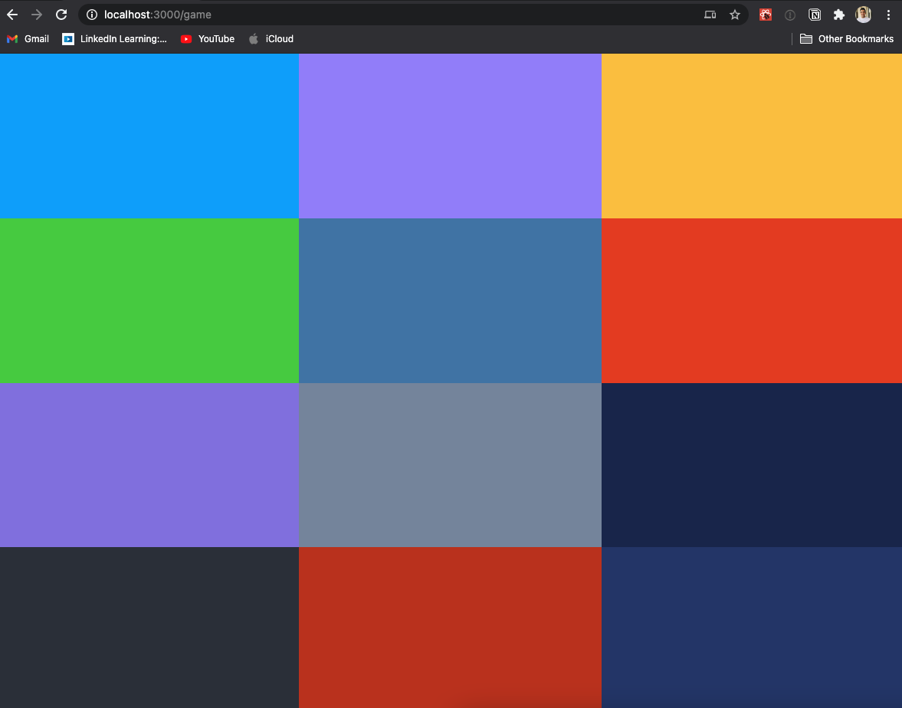

## WORK IN PROGRESS
⚠️ This project is still in progress. If you want to contribute, please open a pull request or an issue. This will make the project to evolve.

# Colorfy
This is a simulation of the classic [Simon](https://en.wikipedia.org/wiki/Simon_(game)) game.

## Demo
The app can be accessed at [https://colorfy.vercel.app/](https://colorfy.vercel.app/).

## Ideas for the project
The main idea for this project is to test the [next.js](https://nextjs.org/), which is a full stack framework that helps you to build a React app with SSR.

Until now, this app is only playing notes, so there isn't anymore progress besides the simple that you can see in the screenshot. But the main idea is to use websocket to allow multiple players to play simultaneously the game. 

## TODO
- [ ] Add match statistics
- [ ] Add current player statistics
- [ ] Init websocket implementation
- [ ] Add chat to allow in match chatting
- [ ] Add multichannel to allow different concurrent matches
- [ ] Add a session for each player
- [ ] Repeat the played notes
